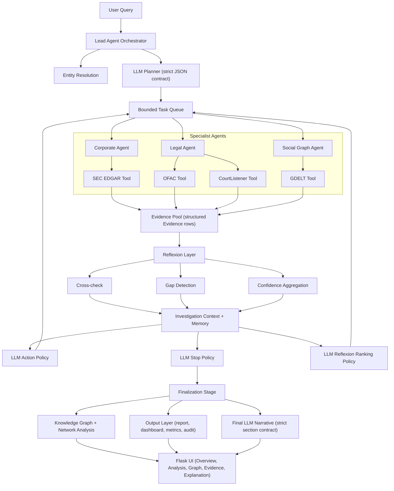

# Architecture Diagram (Current Runtime)

This diagram reflects the current strict LLM-only orchestration runtime.

```mermaid
flowchart TD
    userQuery["User Query"] --> leadAgent["Lead Agent Orchestrator"]
    leadAgent --> entityResolution["Entity Resolution"]
    leadAgent --> llmPlanner["LLM Planner (strict JSON contract)"]
    llmPlanner --> taskQueue["Bounded Task Queue"]

    subgraph specialists [Specialist Agents]
        corporateAgent["Corporate Agent"] --> secEdgar["SEC EDGAR Tool"]
        legalAgent["Legal Agent"] --> ofac["OFAC Tool"]
        legalAgent --> courtlistener["CourtListener Tool"]
        socialGraphAgent["Social Graph Agent"] --> gdelt["GDELT Tool"]
    end

    taskQueue --> corporateAgent
    taskQueue --> legalAgent
    taskQueue --> socialGraphAgent

    secEdgar --> evidencePool["Evidence Pool (structured Evidence rows)"]
    ofac --> evidencePool
    courtlistener --> evidencePool
    gdelt --> evidencePool

    evidencePool --> reflexionLayer["Reflexion Layer"]
    reflexionLayer --> crossCheck["Cross-check"]
    reflexionLayer --> gapDetection["Gap Detection"]
    reflexionLayer --> confidenceAgg["Confidence Aggregation"]

    crossCheck --> contextState["Investigation Context + Memory"]
    gapDetection --> contextState
    confidenceAgg --> contextState

    contextState --> actionPolicy["LLM Action Policy"]
    contextState --> stopPolicy["LLM Stop Policy"]
    contextState --> reflexionPolicy["LLM Reflexion Ranking Policy"]

    actionPolicy --> taskQueue
    reflexionPolicy --> taskQueue
    stopPolicy --> finalStage["Finalization Stage"]

    finalStage --> knowledgeGraph["Knowledge Graph + Network Analysis"]
    finalStage --> outputLayer["Output Layer (report, dashboard, metrics, audit)"]
    finalStage --> llmNarrative["Final LLM Narrative (strict section contract)"]

    knowledgeGraph --> ui["Flask UI (Overview, Analysis, Graph, Evidence, Explanation)"]
    outputLayer --> ui
    llmNarrative --> ui
```

